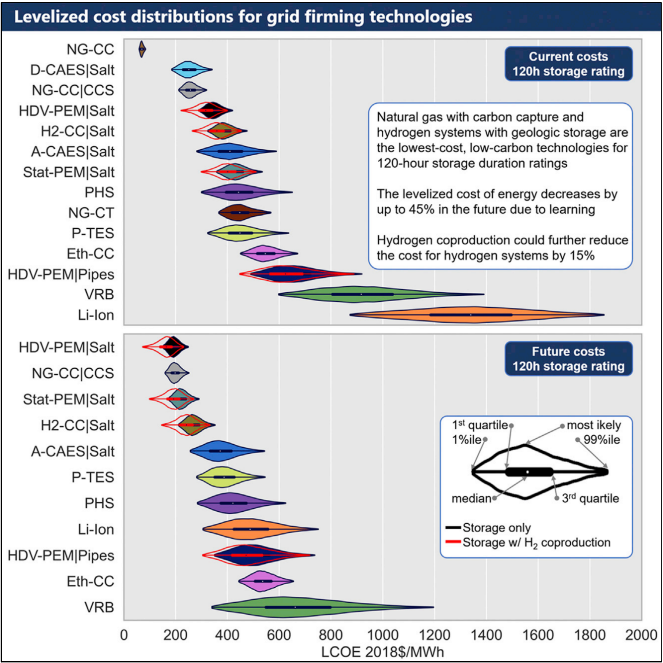

.. _work:

Work Highlights
===============

Below are selected highlights of my research and work.

NREL
----

Techno-economic analysis of long-duration energy storage systems
****************************************************************

As variable renewable energy penetration increases beyond 80%, clean power systems will
require long-duration energy storage or flexible, low-carbon generation.
Here, we provide a detailed techno-economic evaluation and uncertainty analysis of
applicable technologies and identify challenges and opportunities to support electric
grid planning. We show that for a 120-h storage duration rating, hydrogen systems with
geologic storage and natural gas with carbon capture are the least-cost low-carbon
technologies for both current and future capital costs. These results are robust to
uncertainty for the future capital cost scenario, but adiabatic compressed air and
pumped thermal storage could be the least-cost technologies in the current capital
cost scenario under uncertainty. Finally, we present a new storage system using
heavy-duty vehicle fuel cells that could reduce the levelized cost of energy by 13%–20%
compared with the best previously considered storage technology and, thus, could help
enable very high (>80%) renewable energy grids.

Graphical abstract from the long-duration energy storage techno-economic analysis
(`Source <https://doi.org/10.1016/j.joule.2021.06.018>`_)

|

Electrified Heavy-Duty Vehicle Powertrain Total Cost of Ownership Analysis
**************************************************************************
This breakthrough report compares six truck powertrain technologies to quantify their total cost of
ownership (TCO) and identifies operating scenarios where each technology may have an economic
advantage. The powertrains analyzed include conventional diesel, diesel hybrid electric,
plug-in hybrid electric, compressed natural gas, fuel cell electric, and battery all-electric.

Chad provided a DOE H2IQ Hour webinar in September 2021 reviewing this work and the
major conclusions to over 400 attendees.
(`Webinar Link <https://www.energy.gov/eere/fuelcells/h2iq-hour-market-segmentation-medium-and-heavy-duty-vehicles>`_)

.. figure:: _static/cover-page-tp-5400-71796.png
    :width: 312px
    :align: center
    :height: 400px
    :alt: NREL total cost of ownership report
    :figclass: align-center
Report cover from Chad et al.'s Total Cost of Ownership analysis for Class 8 Tractors
and Class 4 Parcel Delivery Trucks
(`Source <https://www.nrel.gov/docs/fy21osti/71796.pdf>`_)

|
